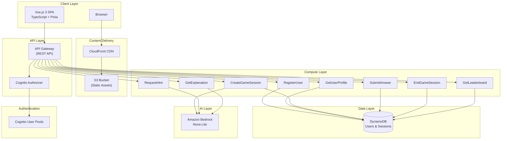
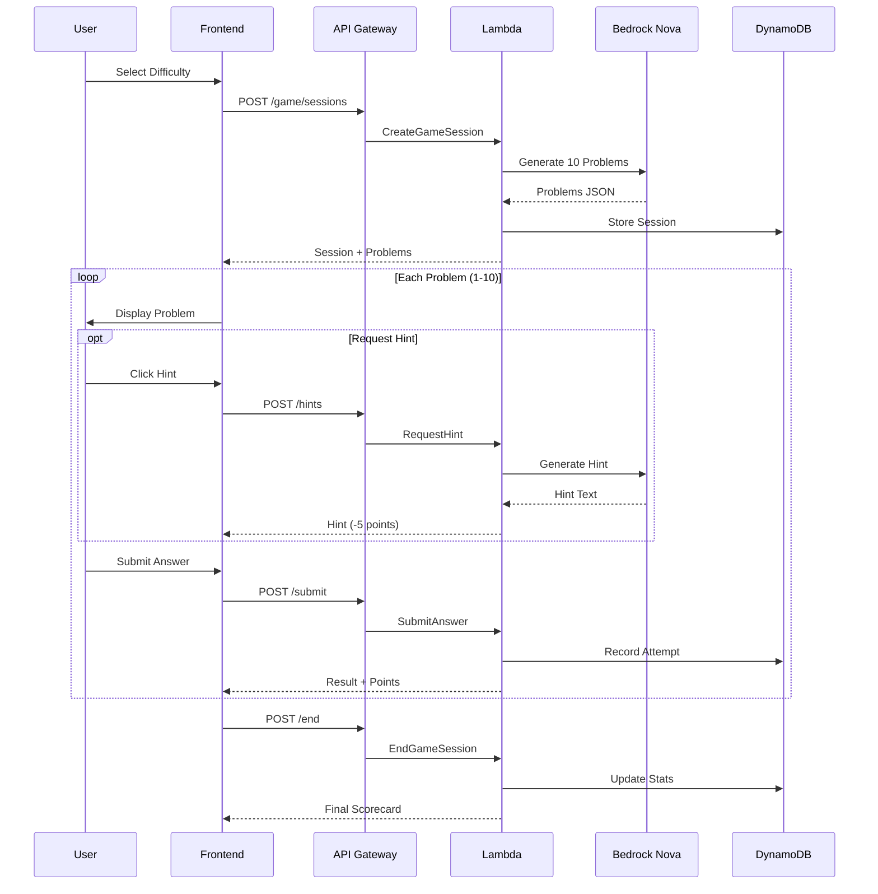
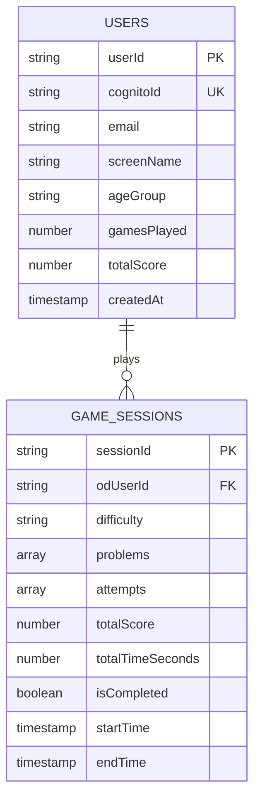
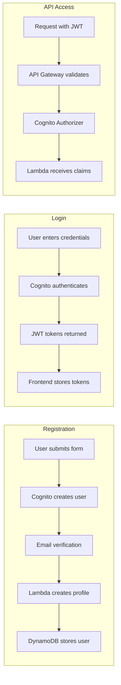

# Number Ninja - Master Math Like a Ninja!

An AI-powered math practice app for kids featuring adaptive difficulty, intelligent hints, and personalized learning through Amazon Bedrock Nova.

## Features

- **AI-Generated Problems**: Amazon Bedrock Nova dynamically generates math problems tailored to difficulty levels
- **Intelligent Hints**: Up to 2 hints per problem with progressive guidance
- **Dynamic Input**: Smart keyboard switching (numeric/text) based on answer type
- **Adaptive Difficulty**: Supports Elementary, Middle School, and High School levels
- **Detailed Scorecard**: Review performance and learn from mistakes
- **Age-Appropriate Explanations**: AI-generated solution explanations matched to student age
- **Anonymous Identity**: Child-friendly randomly generated screen names
- **User Authentication**: Secure email-based registration via AWS Cognito
- **Public Leaderboard**: Global leaderboard showing "Top 10 Ninjas"
- **Mobile Optimized**: Responsive design with touch-friendly controls
- **Modern UI**: Bangers font styling for engaging, kid-friendly interface

## Architecture Overview



## Game Flow



## Technology Stack

### Frontend
| Technology | Purpose |
|------------|---------|
| Vue.js 3 | Framework with Composition API |
| TypeScript | Type safety |
| Vite | Build tool |
| Pinia | State management |
| Vue Router | Navigation |
| Axios | HTTP client |
| Cognito SDK | Authentication |

### Backend
| Technology | Purpose |
|------------|---------|
| AWS Lambda | Serverless compute (Node.js 22.x) |
| API Gateway | REST API with CORS |
| DynamoDB | NoSQL database |
| Bedrock Nova | AI problem/hint generation |
| Cognito | User authentication |
| AWS SAM | Infrastructure as Code |

## Project Structure

```
number-ninja/
├── frontend/                      # Vue.js frontend application
│   ├── src/
│   │   ├── components/           # Reusable Vue components
│   │   │   └── Leaderboard.vue   # Top 10 Ninjas display
│   │   ├── views/                # Page views
│   │   │   ├── HomeView.vue      # Landing page
│   │   │   ├── LoginView.vue     # Authentication
│   │   │   ├── GameView.vue      # Main game interface
│   │   │   ├── ScorecardView.vue # Results display
│   │   │   └── StatsView.vue     # User statistics
│   │   ├── stores/               # Pinia state stores
│   │   ├── services/             # API service layer
│   │   └── types/                # TypeScript definitions
│   ├── Makefile                  # Deployment automation
│   └── package.json
├── backend/                       # Lambda functions
│   ├── src/
│   │   ├── functions/            # Lambda handlers
│   │   └── utils/
│   │       ├── bedrock.ts        # AI integration
│   │       ├── dynamodb.ts       # Database client
│   │       └── usernameGenerator.ts
│   └── package.json
├── template.yaml                  # AWS SAM template
├── frontend-infrastructure.yaml   # CloudFront + S3
└── docs/                          # Documentation
    ├── ARCHITECTURE.md            # System architecture
    ├── DEPLOYMENT.md              # Deployment guide
    ├── FRONTEND-HOSTING.md        # S3 + CloudFront hosting
    ├── SIGNUP-CONTROL.md          # Signup control feature
    ├── MAKEFILE-GUIDE.md          # Frontend build commands
    ├── CLEANUP.md                 # Destruction guide
    ├── GIT-GUIDELINES.md          # Git best practices
    ├── QUICK-REFERENCE.md         # Command cheat sheet
    └── PROJECT_SUMMARY.md         # Project summary
```

## Quick Start

### Prerequisites
- Node.js 22.x or later
- AWS Account with Bedrock access (Nova Lite model)
- AWS SAM CLI installed
- AWS CLI configured

### 1. Enable Amazon Bedrock

```bash
# Go to AWS Console → Amazon Bedrock → Model access
# Request access to "Amazon Nova Lite" model
```

### 2. Deploy Backend

```bash
# From project root
sam build && sam deploy --guided
```

Save the outputs: `ApiUrl`, `UserPoolId`, `UserPoolClientId`

### 3. Deploy Frontend

```bash
cd frontend
make deploy
```

Your app is now live at the CloudFront URL!

## Development

### Local Development

```bash
# Frontend
cd frontend
npm run dev

# Access at http://localhost:3000
```

### Deployment Commands

```bash
# Backend
sam build && sam deploy

# Frontend (production)
cd frontend
ENV=prod make build && ENV=prod make upload && ENV=prod make invalidate
```

## Database Schema



## Authentication Flow



## Scoring System

| Factor | Points |
|--------|--------|
| Correct answer | 5-20 (based on difficulty) |
| Per hint used | -5 points |
| Wrong answer | 0 points |
| Time tracked | No penalty |

## API Endpoints

| Method | Endpoint | Auth | Description |
|--------|----------|------|-------------|
| POST | `/api/users/register` | No | Register new user |
| GET | `/api/users/profile` | Yes | Get user profile |
| GET | `/api/users/sessions` | Yes | Get user's sessions |
| POST | `/api/game/sessions` | Yes | Create game session |
| POST | `/api/game/sessions/{id}/problems/{id}/hints` | Yes | Request hint |
| POST | `/api/game/sessions/{id}/problems/{id}/submit` | Yes | Submit answer |
| POST | `/api/game/sessions/{id}/end` | Yes | End session |
| GET | `/api/game/sessions/{id}/problems/{id}/explanation` | Yes | Get explanation |
| GET | `/api/public/leaderboard` | No | Top 10 Ninjas |
| GET | `/api/public/activity` | No | Activity stats |

## Cost Estimation

| Service | Pricing |
|---------|---------|
| Lambda | Pay per request (free tier) |
| DynamoDB | On-demand (free tier) |
| API Gateway | Pay per API call |
| Cognito | Free under 50K MAUs |
| Bedrock Nova | ~$0.00006/1K input tokens |
| S3 | Minimal storage |
| CloudFront | PriceClass_100 |

**Estimated**: ~$5-15/month for 100 games/day

## Security

- HTTPS only (TLS 1.2+)
- Content Security Policy (CSP)
- HSTS headers
- Private S3 with Origin Access Control
- Cognito JWT authentication
- Input validation
- Rate limiting

## Cleanup

```bash
# Destroy frontend
cd frontend && make destroy

# Destroy backend
make destroy
```

**Warning**: This permanently deletes all data!

## Documentation

| Document | Description |
|----------|-------------|
| [ARCHITECTURE.md](docs/ARCHITECTURE.md) | System architecture with Mermaid diagrams |
| [DEPLOYMENT.md](docs/DEPLOYMENT.md) | Step-by-step deployment guide |
| [FRONTEND-HOSTING.md](docs/FRONTEND-HOSTING.md) | S3 + CloudFront hosting details |
| [SIGNUP-CONTROL.md](docs/SIGNUP-CONTROL.md) | User signup enable/disable feature |
| [MAKEFILE-GUIDE.md](docs/MAKEFILE-GUIDE.md) | Frontend Makefile reference |
| [CLEANUP.md](docs/CLEANUP.md) | Infrastructure destruction guide |
| [GIT-GUIDELINES.md](docs/GIT-GUIDELINES.md) | Version control best practices |
| [QUICK-REFERENCE.md](docs/QUICK-REFERENCE.md) | Command cheat sheet |
| [PROJECT_SUMMARY.md](docs/PROJECT_SUMMARY.md) | Project summary and file structure |

## Author

**Miguel Pereira**
