# Number Ninja - System Architecture

## Overview

Number Ninja is a serverless, cloud-native math tutoring application built on AWS services. It uses Amazon Bedrock Nova for AI-powered math problem generation and intelligent tutoring.

## High-Level Architecture

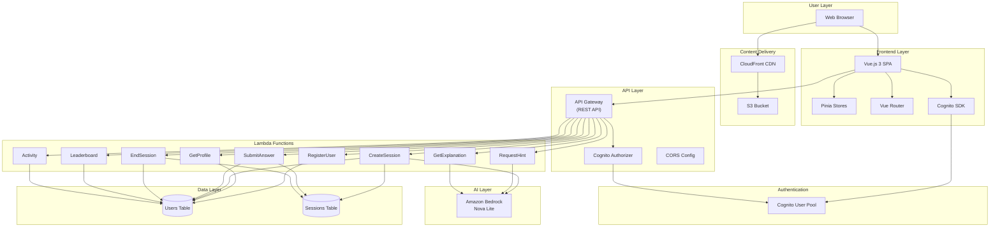

## Component Details

### Frontend Layer

**Technology**: Vue.js 3 with TypeScript, Vite build tool, Bangers font

**Key Components**:

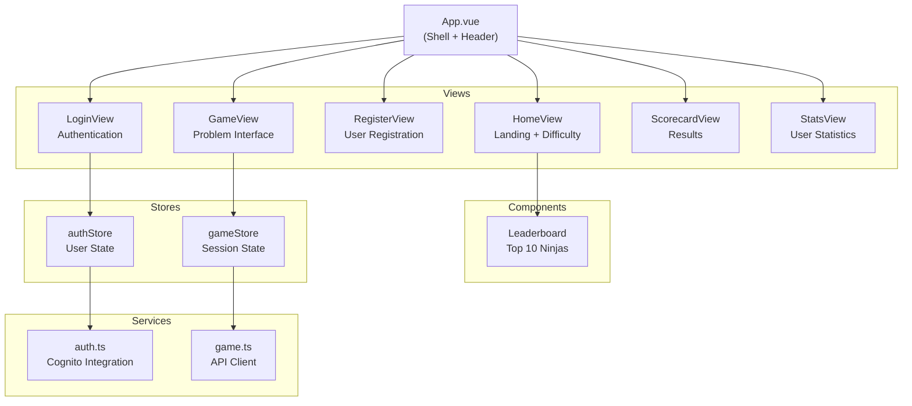

**State Management**:
- `authStore`: User authentication state, tokens, profile
- `gameStore`: Game session, current problem, timer, hints, score

### API Gateway Layer

**Endpoints**:

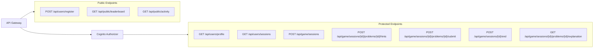

### Lambda Functions

**Runtime**: Node.js 22.x with TypeScript

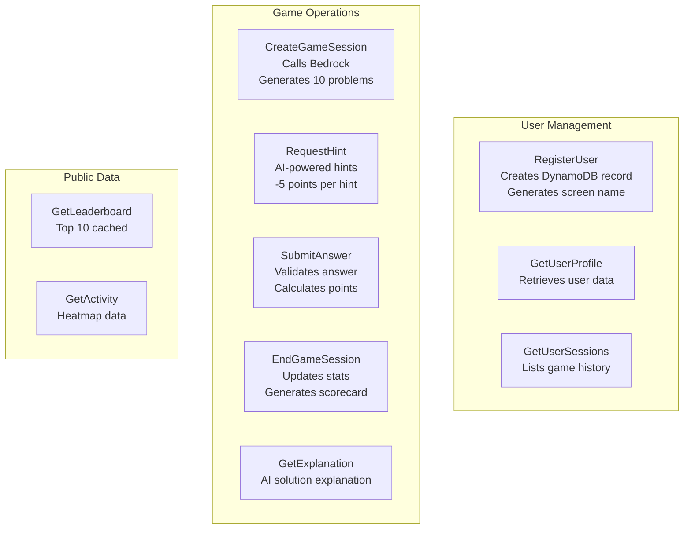

### Amazon Bedrock Integration

**Model**: Amazon Nova Lite (cost-effective, fast)

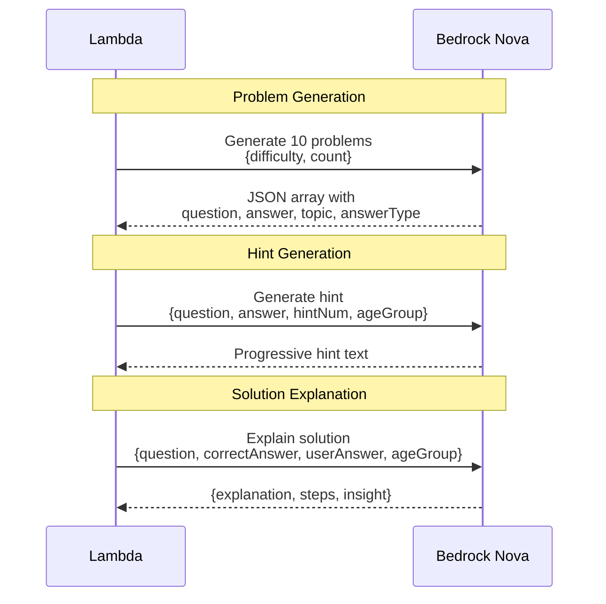

**Problem Types**:
- `answerType: "numeric"` - Numeric keypad on mobile
- `answerType: "text"` - Full keyboard for pattern/word answers

### Authentication Flow

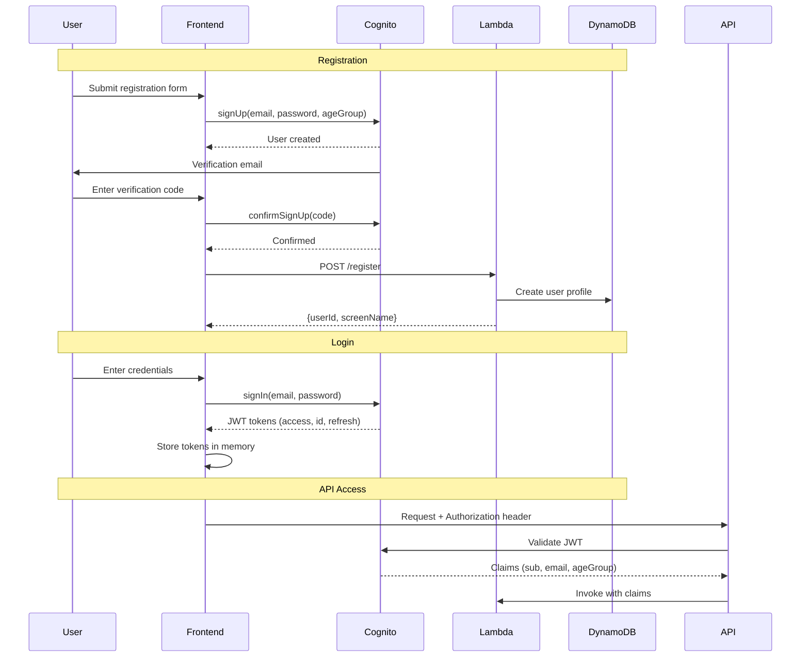

### Database Schema

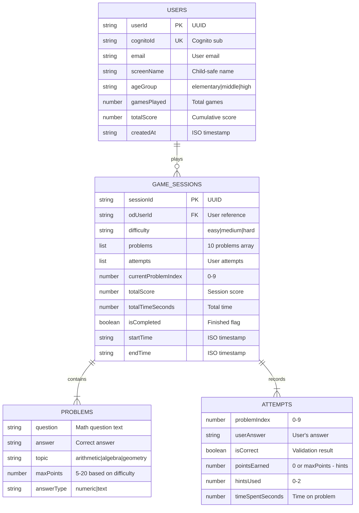

**DynamoDB Indexes**:
- Users Table: GSI on `cognitoId` for fast lookup after login
- Sessions Table: GSI on `odUserId` for user session history

## Data Flows

### Starting a New Game

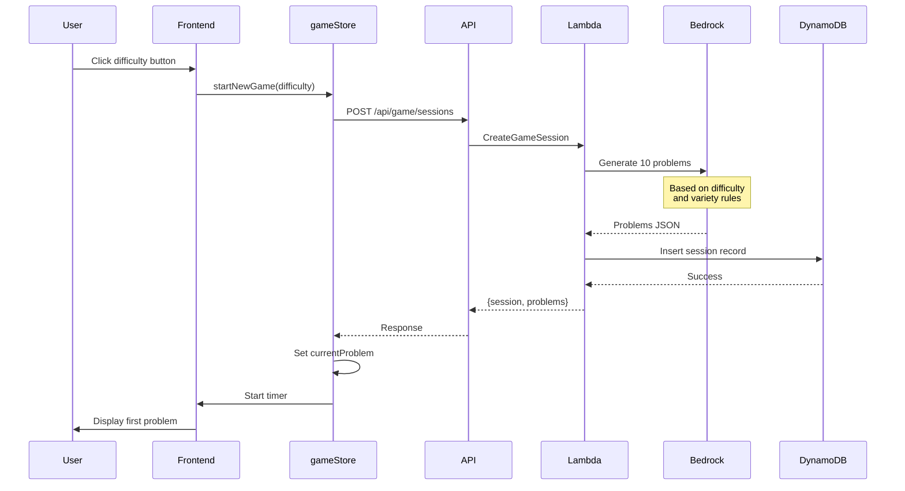

### Submitting an Answer

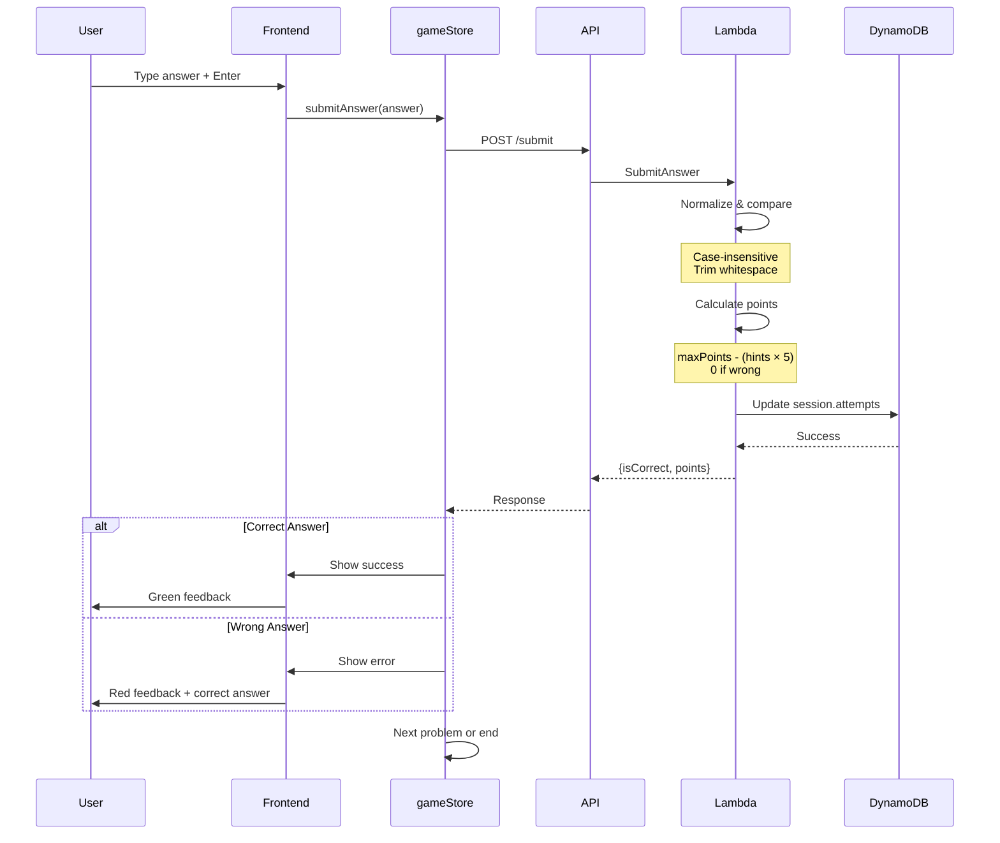

### Requesting a Hint

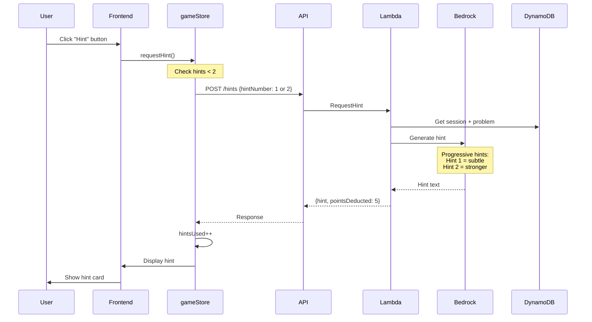

## Security Architecture

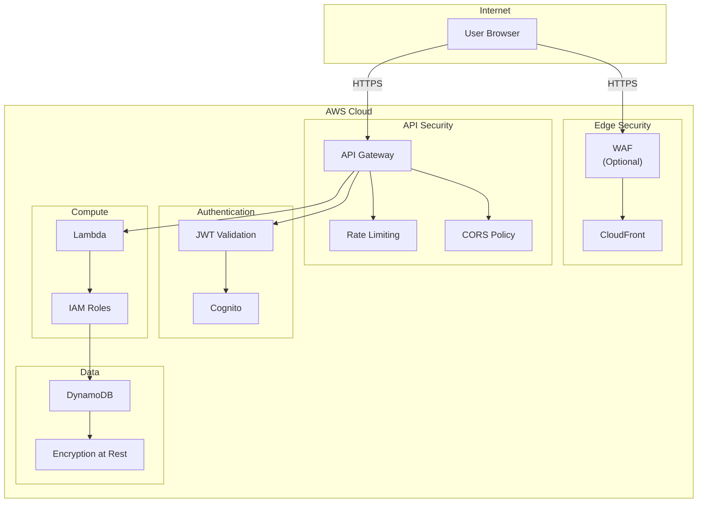

**Security Measures**:
- HTTPS/TLS 1.2+ for all communication
- JWT tokens with short expiration
- Cognito Authorizer on protected endpoints
- Lambda ownership verification (user can only access own data)
- IAM least-privilege policies
- DynamoDB encryption at rest
- CloudFront Origin Access Control (private S3)
- Content Security Policy headers
- HSTS headers

## Scalability

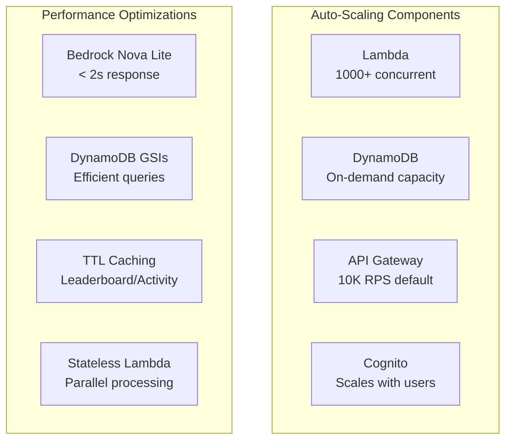

## Cost Optimization

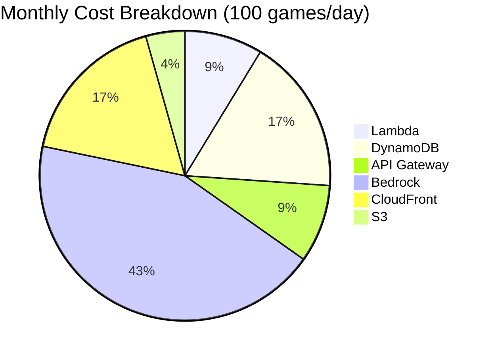

**Pay-per-use Model**:
- Lambda: ~$1/month (free tier)
- DynamoDB: ~$2/month (on-demand)
- Bedrock Nova Lite: ~$5/month (cheapest model)
- API Gateway: ~$1/month
- CloudFront + S3: ~$2.50/month

**Total**: ~$10-15/month for moderate usage

## Monitoring & Observability

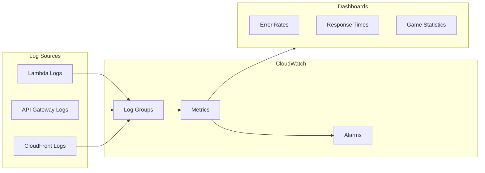

**Key Metrics**:
- API response times (p50, p95, p99)
- Lambda cold start frequency
- Bedrock response latency
- Error rates by endpoint
- Games played per day
- User engagement metrics

## Infrastructure as Code

All infrastructure defined in AWS SAM templates:

```
template.yaml                    # Backend (Lambda, API GW, DynamoDB, Cognito)
frontend-infrastructure.yaml     # Frontend (S3, CloudFront, WAF)
```

**Deployment Flow**:

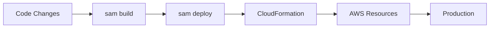

## Future Enhancements

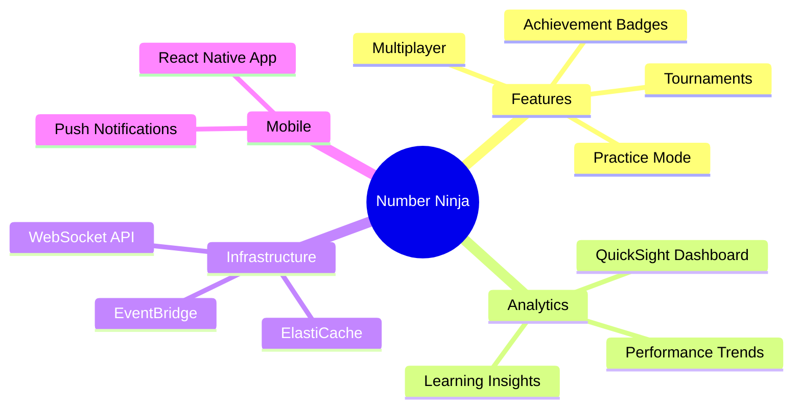
