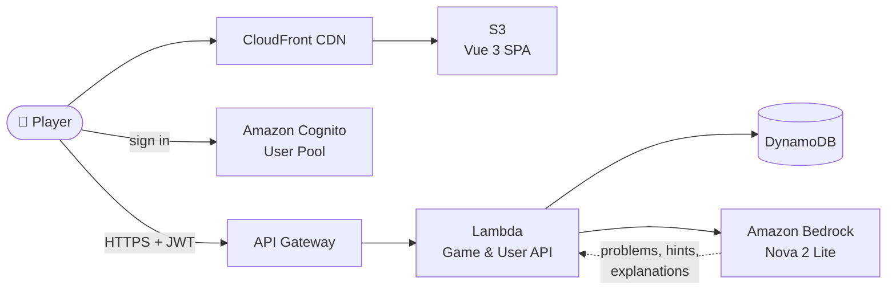
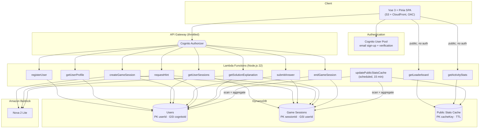

# Number Ninja — Architecture

Number Ninja is an AI-powered math practice platform for kids: adaptive
difficulty, AI-generated problems and hints, and per-user progress tracking.
It is a fully serverless application on AWS.

All names below are logical; no environment-specific identifiers or endpoints
appear in this document.

## Product Overview

A player loads the Vue single-page app from CloudFront, signs in with Cognito,
and plays 10-problem game sessions. Every game API call carries the player's
JWT; Lambda functions generate content with Amazon Bedrock and keep all
scoring state server-side in DynamoDB.

## Detailed Architecture

## Key Design Points

- **Identity comes from the JWT.** Every authenticated endpoint (including
  registration) derives the caller's identity from the verified Cognito
  claims, never from the request body.
- **Scoring is server-authoritative.** `requestHint` records issued hints on
  the session; `submitAnswer` scores from that record, rejects duplicate or
  post-completion submissions, and appends attempts atomically with an
  optimistic lock. `endGameSession` is idempotent — user stats are credited
  exactly once per session.
- **Public stats are decoupled.** The leaderboard and activity endpoints only
  read a TTL'd cache table that a scheduled function refreshes, so public
  traffic never touches the primary tables.
- **AI content generation.** Problems, hints, and age-appropriate solution
  explanations are generated with Amazon Bedrock Nova 2 Lite; text answers
  are independently re-solved at low temperature to filter hallucinated
  answers before a session starts.
- **Data protection.** The tables and user pool carry deletion/replacement
  retention policies and point-in-time recovery; the API stage is throttled.

## Request Flow (typical game)

1. `POST /api/game/sessions` — generates 10 problems via Bedrock, stores the
   session.
2. `POST .../problems/{id}/hints` — up to 2 hints per problem (−5 points
   each), recorded server-side.
3. `POST .../problems/{id}/submit` — validates the answer (exact match +
   fraction equivalence), scores it, appends the attempt.
4. `POST .../end` — finalizes the session and returns the scorecard;
   `GET .../explanation` explains missed problems on demand.
