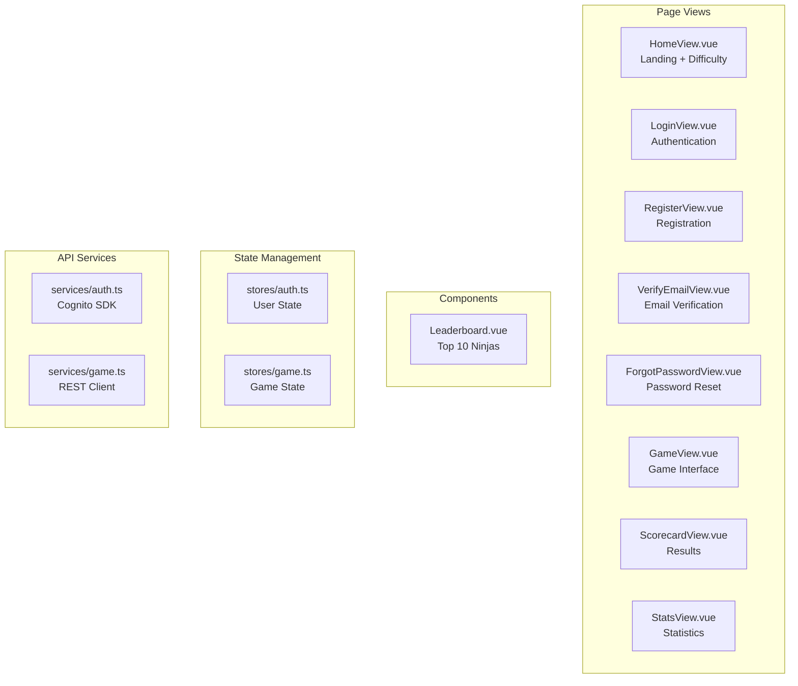
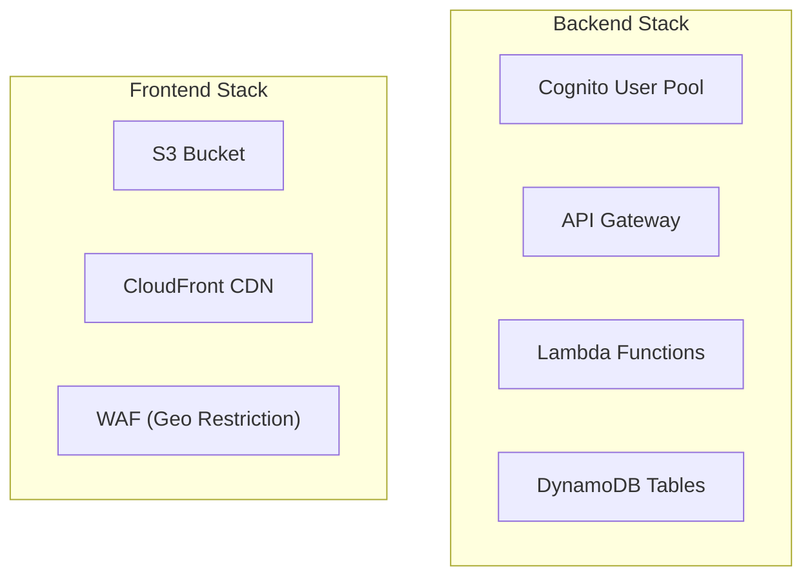
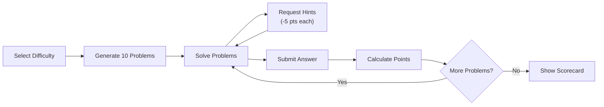
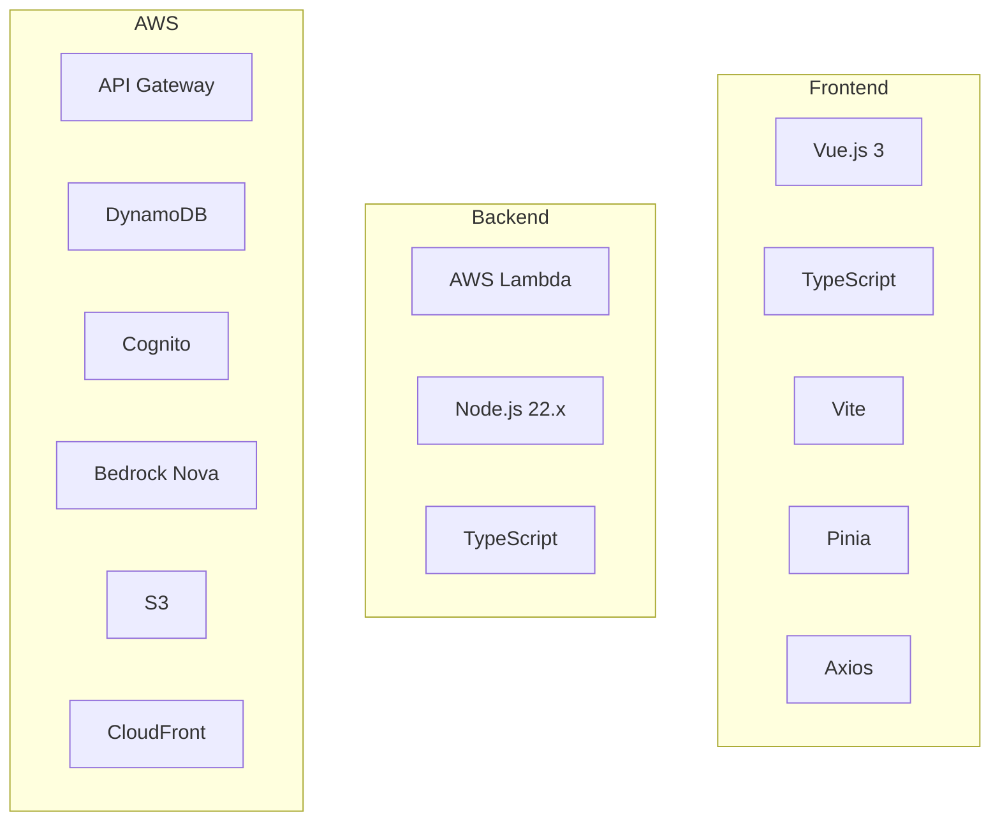

# Number Ninja - Project Summary

## Overview

A production-ready, AI-powered math tutoring game for kids. Students solve dynamically generated math problems, receive intelligent hints, track their performance, and learn from age-appropriate explanations powered by Amazon Bedrock Nova.

## What Was Built

### Frontend Application (Vue.js 3)

**Location**: `frontend/`



**Key Features**:
- Vue.js 3 with Composition API and TypeScript
- Pinia for state management
- Bangers font for kid-friendly styling
- Mobile-optimized responsive design
- Dynamic keyboard input (numeric/text based on answer type)

### Backend API (AWS Lambda + Node.js)

**Location**: `backend/`

```mermaid
graph LR
    subgraph Functions["Lambda Functions"]
        R["register.ts"]
        P["getUserProfile.ts"]
        S["getUserSessions.ts"]
        C["createGameSession.ts"]
        H["requestHint.ts"]
        A["submitAnswer.ts"]
        E["endGameSession.ts"]
        X["getSolutionExplanation.ts"]
        L["getLeaderboard.ts"]
        AC["getActivity.ts"]
    end

    subgraph Utils["Utilities"]
        DB["dynamodb.ts"]
        BR["bedrock.ts"]
        UN["usernameGenerator.ts"]
    end

    Functions --> Utils
```



### Infrastructure as Code (AWS SAM)

**Templates**:
- `template.yaml` - Backend resources
- `frontend-infrastructure.yaml` - Frontend hosting



## File Structure

```
number-ninja/
├── README.md                          # Main documentation
├── ARCHITECTURE.md                    # System architecture
├── PROJECT_SUMMARY.md                 # This file
├── template.yaml                      # AWS SAM template
├── frontend-infrastructure.yaml       # CloudFront + S3
├── Makefile                           # Backend commands
│
├── frontend/
│   ├── Makefile                       # Frontend deployment
│   ├── index.html                     # Entry point + Google Fonts
│   └── src/
│       ├── App.vue                    # Shell + Header (Ninja branding)
│       ├── style.css                  # Global styles + Bangers font
│       ├── types/index.ts             # TypeScript definitions
│       ├── router/index.ts            # Vue Router config
│       ├── stores/
│       │   ├── auth.ts                # Authentication state
│       │   └── game.ts                # Game session state
│       ├── services/
│       │   ├── auth.ts                # Cognito integration
│       │   └── game.ts                # API client
│       ├── components/
│       │   └── Leaderboard.vue        # Top 10 Ninjas
│       └── views/
│           ├── HomeView.vue           # Landing page
│           ├── LoginView.vue          # Login (mobile optimized)
│           ├── RegisterView.vue       # Registration
│           ├── VerifyEmailView.vue    # Email verification
│           ├── ForgotPasswordView.vue # Password reset
│           ├── ResetPasswordView.vue  # New password
│           ├── GameView.vue           # Game interface
│           ├── ScorecardView.vue      # Results display
│           └── StatsView.vue          # User statistics
│
├── backend/
│   └── src/
│       ├── functions/
│       │   ├── register.ts
│       │   ├── getUserProfile.ts
│       │   ├── getUserSessions.ts
│       │   ├── createGameSession.ts
│       │   ├── requestHint.ts
│       │   ├── submitAnswer.ts
│       │   ├── endGameSession.ts
│       │   ├── getSolutionExplanation.ts
│       │   ├── getLeaderboard.ts
│       │   └── getActivity.ts
│       └── utils/
│           ├── dynamodb.ts
│           ├── bedrock.ts
│           └── usernameGenerator.ts
│
└── docs/
    ├── ARCHITECTURE.md                # System architecture
    ├── PROJECT_SUMMARY.md             # This file
    └── MAKEFILE-GUIDE.md              # Frontend build commands
```

## Key Features

### Game Mechanics



- 10 problems per game session
- Real-time timer for each problem
- Up to 2 hints per problem (5 points deduction each)
- Dynamic keyboard (numeric vs text) based on answer type
- Instant feedback on submissions
- Comprehensive scorecard with explanations

### AI Integration (Amazon Bedrock Nova)

- **Problem Generation**: Varied, age-appropriate math problems
- **Hint Generation**: Progressive, context-aware hints
- **Solution Explanations**: Step-by-step walkthroughs with learning insights
- **Answer Type Detection**: `answerType: "numeric" | "text"` for smart keyboard

### User Experience

- **Branding**: Number Ninja with ninja emoji and Bangers font
- **Mobile Optimized**: Responsive design, touch-friendly controls
- **Visual Design**: Gradients, animations, clean typography
- **Accessibility**: 16px input fonts (prevents iOS zoom)

### Security

- Cognito authentication with JWT tokens
- API Gateway authorizer
- User ownership verification
- HTTPS/TLS encryption
- Content Security Policy headers

## Technology Stack



## Deployment

### Backend
```bash
sam build && sam deploy
```

### Frontend
```bash
cd frontend
ENV=prod make build && ENV=prod make upload && ENV=prod make invalidate
```

## Cost Estimate

For moderate usage (100 games/day):

| Service | Cost/Month |
|---------|------------|
| Lambda | ~$1 |
| DynamoDB | ~$2 |
| API Gateway | ~$1 |
| Bedrock | ~$5 |
| CloudFront + S3 | ~$2.50 |
| **Total** | **~$11.50** |

## Recent Updates

- Rebranded from "Math Tutor" to "Number Ninja"
- Added Bangers font for kid-friendly typography
- Implemented mobile-responsive design across all views
- Added dynamic keyboard input based on answer type
- Optimized touch targets and input sizes for mobile
- Added "Top 10 Ninjas" leaderboard branding
- Logout redirects to home page

## Future Enhancements

- [ ] Multiplayer competitions
- [ ] Achievement badges
- [ ] Progress analytics dashboard
- [ ] Parent/teacher portal
- [ ] Mobile app (React Native)
- [ ] Additional subjects
